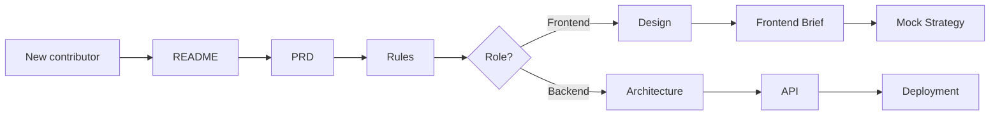
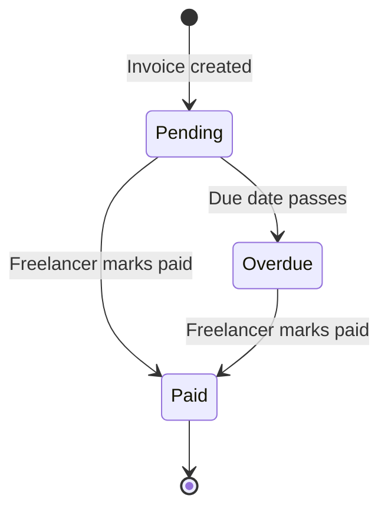

<!--
/**
 * @file docs/README.md
 * @description Documentation index and reading guide for the Payment Chaser project
 * @phase 0
 * @author Payment Chaser Team
 * @created 2026-10-01
 */
-->

# Payment Chaser — Documentation Index

> Freelancers shouldn't have to chase money. Payment Chaser does the awkward follow-ups for them — politely, on time, and on the channel the client actually reads.

This folder is the single source of truth for what we are building, why, and how. Read it top to bottom once; after that, treat each file as a reference.

---

## 1. What is Payment Chaser?

Payment Chaser is a SaaS product that helps freelancers get paid on time.

| Step | What happens |
|------|--------------|
| 1. Upload | The freelancer adds an invoice (amount, client, due date) |
| 2. Schedule | They pick a reminder template and tone |
| 3. Chase | The system sends automated **email** and **WhatsApp** reminders |
| 4. Track | The dashboard shows pending, paid, and overdue invoices |

**Target users:** freelancers in Bangladesh and globally (designers, developers, writers, marketers, translators).

**Why it matters:** late payment is the most common cash-flow problem for freelancers. Most never follow up because it feels rude. We remove the social cost.

---

## 2. Tech Stack

| Layer | Technology | Why |
|-------|-----------|-----|
| Framework | Next.js 16 (App Router) | Server Components + Server Actions, one deploy target |
| Language | TypeScript (strict) | Catch bugs before runtime; no `any` |
| Styling | Tailwind CSS + Shadcn UI | Fast, consistent, accessible components |
| Database / Auth | Supabase (Postgres + RLS) | Row-level security keeps each freelancer's data private |
| Payments | Paddle | Merchant of Record — handles global tax; **not Stripe** |
| Email | Resend | Reliable transactional email, simple API |
| WhatsApp | WhatsApp Business API | Reaches clients where they actually respond (especially in Bangladesh) |
| Hosting | Vercel | Zero-config Next.js hosting + Cron |

---

## 3. Document Map

Read in this order the first time:

| # | File | Purpose | Audience |
|---|------|---------|----------|
| 1 | [README.md](./README.md) | This index | Everyone |
| 2 | [prd.md](./prd.md) | Problem, goals, user stories, acceptance criteria, non-goals | Product, everyone |
| 3 | [architecture.md](./architecture.md) | System diagram, data flow, DB schema, RLS | Backend, full-stack |
| 4 | [rules.md](./rules.md) | Coding, Git, and security rules | Every contributor |
| 5 | [design.md](./design.md) | Colors, typography, spacing, 12-page breakdown | Frontend, design |
| 6 | [task.md](./task.md) | Phase-by-phase task list | Everyone |
| 7 | [memory.md](./memory.md) | Project context, decisions, learnings | Everyone (living doc) |
| 8 | [api.md](./api.md) | All Server Actions and webhooks | Backend, frontend |
| 9 | [deployment.md](./deployment.md) | Supabase + Vercel + Paddle setup | DevOps, backend |
| 10 | [frontend-brief.md](./frontend-brief.md) | Complete partner brief: pages, components, mock strategy | Frontend partner |
| 11 | [mock-strategy.md](./mock-strategy.md) | How to use mocks and swap them for real data | Frontend, backend |

### Reading paths by role



---

## 4. Quick Start

> Full setup lives in the root `README.md`. This is the 60-second version.

```bash
# 1. Install dependencies
npm install

# 2. Copy environment template
cp .env.example .env.local

# 3. Keep mocks on while building UI (no backend needed)
#    In .env.local:
#    NEXT_PUBLIC_USE_MOCK=true

# 4. Run the dev server
npm run dev
```

Open <http://localhost:3000>.

### Mock mode vs real mode

| Mode | `NEXT_PUBLIC_USE_MOCK` | Data source | Use when |
|------|------------------------|-------------|----------|
| Mock | `true` | `src/lib/mock/*` | Building UI, demos, partner onboarding |
| Real | `false` | Supabase | Integration testing, staging, production |

Read [mock-strategy.md](./mock-strategy.md) before touching either side.

---

## 5. Project Structure (target)

```
payment-chaser/
├── docs/                      # You are here
├── src/
│   ├── app/
│   │   ├── actions/           # Server Actions (invoices, clients, templates, dashboard)
│   │   ├── api/
│   │   │   ├── cron/          # /api/cron/send-reminders
│   │   │   └── webhooks/      # Paddle, WhatsApp, Resend
│   │   └── (routes)/          # Pages (see design.md for the 12-page breakdown)
│   ├── components/            # UI components (Shadcn in components/ui)
│   ├── lib/
│   │   ├── config.ts          # USE_MOCK flag and env access
│   │   ├── constants.ts       # Routes, status labels, tone options
│   │   ├── utils.ts           # cn() and helpers
│   │   └── mock/              # Mock data + mock functions
│   └── types/
│       └── index.ts           # Every shared interface
├── .github/                   # PR/issue templates, CI
├── tailwind.config.ts
├── vercel.json                # Cron schedule
└── .env.example
```

---

## 6. Core Domain Concepts

| Concept | Definition |
|---------|-----------|
| **Invoice** | A bill the freelancer issued to a client, with amount, due date, and status |
| **Client** | The person or company who owes money; holds email and WhatsApp number |
| **Template** | A reusable reminder message with a tone (Friendly, Firm, Urgent) |
| **Reminder** | One scheduled or sent message for an invoice on a specific channel |
| **Channel** | `email` or `whatsapp` |
| **Tone** | `friendly`, `firm`, or `urgent` — escalates as the invoice ages |
| **Status** | `pending`, `paid`, or `overdue` |

### Invoice lifecycle



### Reminder escalation (default)

| When | Tone | Channels |
|------|------|----------|
| 3 days before due date | Friendly | Email |
| On due date | Friendly | Email + WhatsApp |
| 3 days overdue | Firm | Email + WhatsApp |
| 7+ days overdue | Urgent | Email + WhatsApp |

Users can override the schedule per invoice.

---

## 7. Conventions at a Glance

Full details in [rules.md](./rules.md). The short list:

1. **TypeScript strict** — `any` is not allowed.
2. **Server Components by default** — add `'use client'` only when you need state, effects, or browser APIs.
3. **Zod on every form** — validate on the client and again in the Server Action.
4. **RLS on every table** — no exceptions; a table without a policy is a bug.
5. **Try/catch on every async call** — return typed errors, never leak stack traces.
6. **Comments explain *why*, never *what*.** Bangla comments are welcome where they help the team.
7. **Environment variables come from `process.env`** — never hardcode secrets.
8. **No `console.log`** in committed code.

### Regional defaults

| Setting | Value |
|---------|-------|
| Default currency | USD |
| Default timezone | Asia/Dhaka |
| Payment provider | Paddle (never Stripe) |
| Languages | English first; Bangla copy for reminders is on the roadmap |

---

## 8. File Header Standard

Every source file starts with this header:

```ts
/**
 * @file <path>
 * @description <one-line purpose>
 * @phase <phase number>
 * @author Payment Chaser Team
 * @created YYYY-MM-DD
 */
```

Markdown files wrap the same block in an HTML comment so it does not render.

---

## 9. Build Phases

| Phase | Scope | Files |
|-------|-------|-------|
| 0 | Documentation | 11 |
| 1 | Project setup (Tailwind, env, Vercel, Next, TS) | 5 |
| 2 | Types & config | 4 |
| 3 | Mock data | 5 |
| 4 | Server Action stubs | 4 |
| 5 | GitHub templates + CI | 4 |
| 6 | Repo files (gitignore, README, CONTRIBUTING, LICENSE) | 4 |
| | **Total** | **37** |

The checklist with owners and status lives in [task.md](./task.md).

---

## 10. Working With a Frontend Partner

The frontend can be built entirely against mocks. The contract is:

- **Types** in `src/types/index.ts` are the source of truth for data shapes.
- **Mock functions** match Server Action signatures *exactly*, including a 500 ms delay to expose loading states.
- **Server Action stubs** return mock data for reads and throw `"Not implemented yet"` for writes until the backend lands.
- Swapping mock → real changes **one flag**, not any component.

If you are the frontend partner, jump straight to [frontend-brief.md](./frontend-brief.md).

---

## 11. Decision Log Pointer

Architecture and product decisions are recorded in [memory.md](./memory.md). Before proposing a change to the stack, schema, or provider, check there first — it may already have been decided and for what reason.

---

## 12. Glossary

| Term | Meaning |
|------|---------|
| RLS | Row-Level Security — Postgres policies that restrict rows per user |
| MoR | Merchant of Record — Paddle sells on our behalf and handles tax |
| Server Action | A server-side function callable from components, marked `'use server'` |
| Cron | Scheduled job; Vercel triggers `/api/cron/send-reminders` |
| Mock mode | Running the app on in-memory sample data |
| WABA | WhatsApp Business Account |

---

## 13. Maintenance

- Update the relevant doc **in the same PR** as the code change.
- If a decision changes, add an entry to `memory.md` and link it from the affected doc.
- Keep tables and Mermaid diagrams current — stale diagrams are worse than none.
- Docs are reviewed like code: one approval minimum.

---

## 14. Contact & Ownership

| Area | Owner |
|------|-------|
| Product / PRD | Payment Chaser Team |
| Backend / Supabase | Payment Chaser Team |
| Frontend / Design | Frontend partner |
| Deployment | Payment Chaser Team |

For contribution rules, see the root `CONTRIBUTING.md`.
