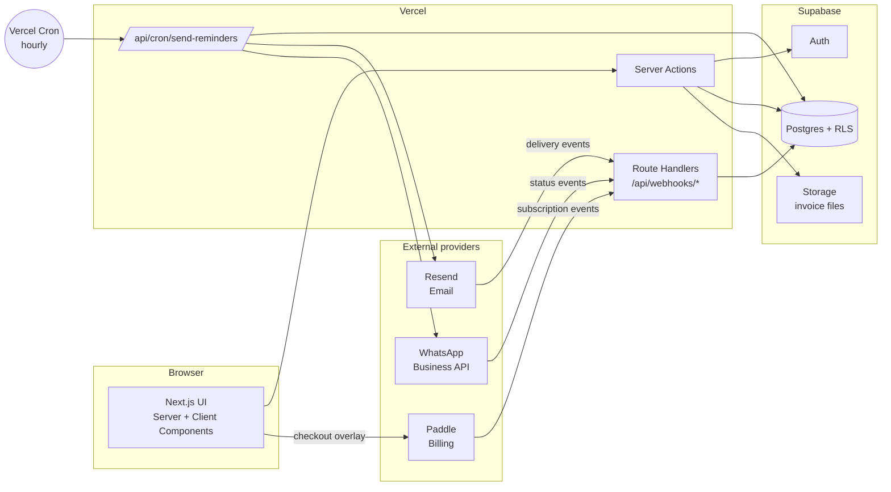
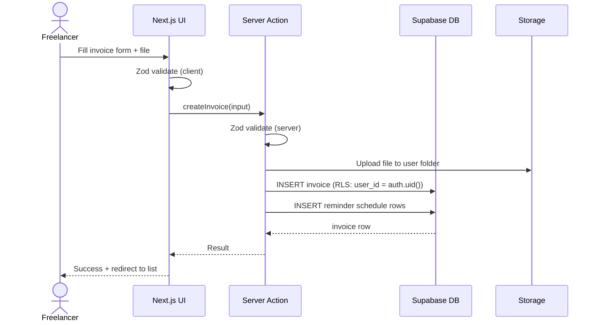
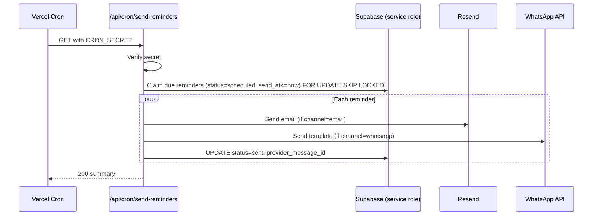
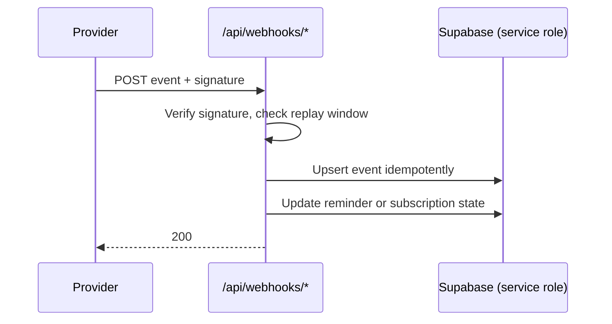
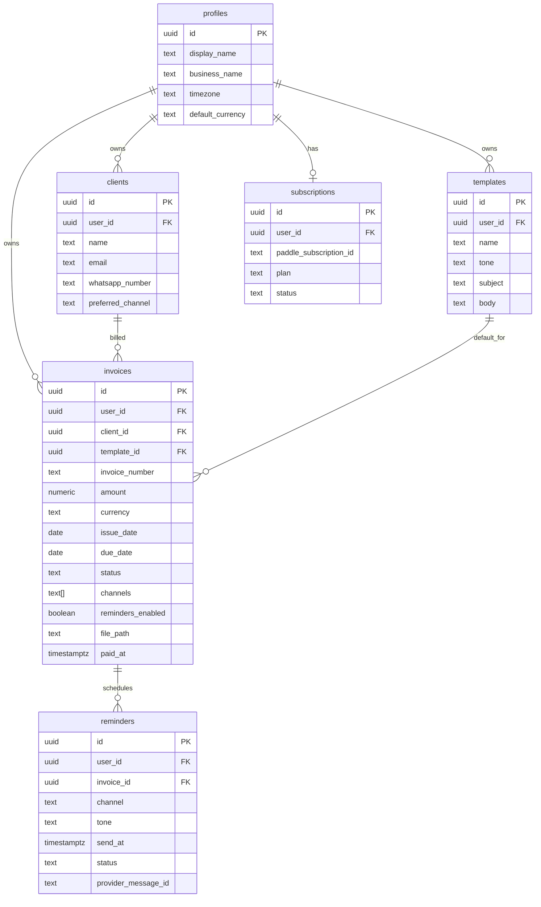
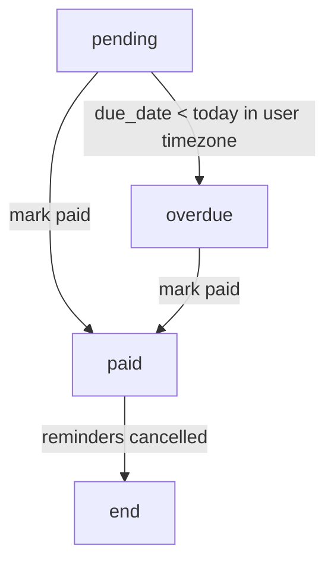

<!--
/**
 * @file docs/architecture.md
 * @description System architecture: diagrams, data flow, database schema, and RLS policies
 * @phase 0
 * @author Payment Chaser Team
 * @created 2026-10-01
 */
-->

# Payment Chaser — Architecture

| Field | Value |
|-------|-------|
| Status | Draft v1.0 |
| Last updated | 2026-10-01 |
| Related | [prd.md](./prd.md), [api.md](./api.md), [deployment.md](./deployment.md) |

---

## 1. Architecture Principles

| # | Principle | Consequence |
|---|-----------|-------------|
| 1 | One deployable unit | Next.js App Router on Vercel handles UI, Server Actions, webhooks, and cron |
| 2 | Server Components by default | Less client JS; data fetched next to where it renders |
| 3 | Database is the security boundary | Row-Level Security on every table; app code is not trusted to filter by user |
| 4 | Providers are replaceable | Email, WhatsApp, and billing sit behind small service modules |
| 5 | Mock-first frontend | `USE_MOCK` swaps data sources without touching components |
| 6 | Idempotent background work | Reminder sending can be retried without double-sending |
| 7 | Secrets only in env vars | Nothing hardcoded, nothing logged |

---

## 2. System Diagram



### Component responsibilities

| Component | Responsibility |
|-----------|---------------|
| Next.js UI | Rendering, forms, optimistic updates |
| Server Actions | Authenticated mutations and reads; Zod validation; call Supabase |
| Route Handlers | Inbound webhooks only (Paddle, Resend, WhatsApp) with signature checks |
| Cron handler | Finds due reminders, sends them, records results |
| Supabase Auth | Sessions and user identity (`auth.uid()`) |
| Supabase Postgres | System of record; RLS enforces ownership |
| Supabase Storage | Private bucket for invoice PDFs/images |
| Resend | Outbound email, delivery events |
| WhatsApp Business API | Outbound template messages, status events |
| Paddle | Checkout, subscriptions, tax (Merchant of Record) |

---

## 3. Data Flow

### 3.1 Create an invoice



### 3.2 Scheduled reminder sending



### 3.3 Delivery status and billing webhooks



---

## 4. Request Boundaries & Auth

| Surface | Auth method | DB client |
|---------|-------------|-----------|
| Pages and Server Actions | Supabase session cookie | Anon key + user JWT (RLS applies) |
| Cron handler | `Authorization: Bearer ${CRON_SECRET}` | Service role (bypasses RLS, server only) |
| Webhooks | Provider signature verification | Service role (bypasses RLS, server only) |

**Rule:** the service role key is used only in cron and webhook handlers. It never reaches a Client Component or a browser bundle.

---

## 5. Database Schema

### 5.1 Entity relationship diagram



### 5.2 Table summary

| Table | Purpose | Key constraints |
|-------|---------|-----------------|
| `profiles` | One row per user; settings | `id` references `auth.users` |
| `clients` | People/companies who owe money | Unique `(user_id, email)` |
| `templates` | Reusable message bodies by tone | Unique `(user_id, name)` |
| `invoices` | Bills to chase | `amount > 0`, `due_date >= issue_date` |
| `reminders` | One row per scheduled/sent message | Unique `(invoice_id, channel, send_at)` for idempotency |
| `subscriptions` | Paddle plan state | One row per user |
| `webhook_events` | Idempotency log for inbound events | Unique `(provider, event_id)` |

### 5.3 SQL migration (initial)

```sql
-- Extensions
create extension if not exists "pgcrypto";

-- Enums as checked text keeps migrations simple
create table public.profiles (
  id uuid primary key references auth.users(id) on delete cascade,
  display_name text not null default '',
  business_name text,
  timezone text not null default 'Asia/Dhaka',
  default_currency text not null default 'USD',
  created_at timestamptz not null default now()
);

create table public.clients (
  id uuid primary key default gen_random_uuid(),
  user_id uuid not null references public.profiles(id) on delete cascade,
  name text not null,
  email text,
  whatsapp_number text,
  preferred_channel text not null default 'email'
    check (preferred_channel in ('email', 'whatsapp')),
  created_at timestamptz not null default now(),
  unique (user_id, email),
  check (email is not null or whatsapp_number is not null)
);

create table public.templates (
  id uuid primary key default gen_random_uuid(),
  user_id uuid not null references public.profiles(id) on delete cascade,
  name text not null,
  tone text not null check (tone in ('friendly', 'firm', 'urgent')),
  subject text not null,
  body text not null,
  created_at timestamptz not null default now(),
  unique (user_id, name)
);

create table public.invoices (
  id uuid primary key default gen_random_uuid(),
  user_id uuid not null references public.profiles(id) on delete cascade,
  client_id uuid not null references public.clients(id) on delete restrict,
  template_id uuid references public.templates(id) on delete set null,
  invoice_number text not null,
  amount numeric(12, 2) not null check (amount > 0),
  currency text not null default 'USD',
  issue_date date not null,
  due_date date not null,
  status text not null default 'pending'
    check (status in ('pending', 'paid', 'overdue')),
  channels text[] not null default '{email}',
  reminders_enabled boolean not null default true,
  file_path text,
  paid_at timestamptz,
  created_at timestamptz not null default now(),
  check (due_date >= issue_date),
  unique (user_id, invoice_number)
);

create table public.reminders (
  id uuid primary key default gen_random_uuid(),
  user_id uuid not null references public.profiles(id) on delete cascade,
  invoice_id uuid not null references public.invoices(id) on delete cascade,
  channel text not null check (channel in ('email', 'whatsapp')),
  tone text not null check (tone in ('friendly', 'firm', 'urgent')),
  send_at timestamptz not null,
  status text not null default 'scheduled'
    check (status in ('scheduled', 'sent', 'delivered', 'failed', 'cancelled')),
  attempts int not null default 0,
  provider_message_id text,
  error text,
  sent_at timestamptz,
  created_at timestamptz not null default now(),
  unique (invoice_id, channel, send_at)
);

create table public.subscriptions (
  id uuid primary key default gen_random_uuid(),
  user_id uuid not null unique references public.profiles(id) on delete cascade,
  paddle_subscription_id text unique,
  paddle_customer_id text,
  plan text not null default 'free' check (plan in ('free', 'pro', 'studio')),
  status text not null default 'active',
  current_period_end timestamptz,
  updated_at timestamptz not null default now()
);

create table public.webhook_events (
  id uuid primary key default gen_random_uuid(),
  provider text not null check (provider in ('paddle', 'resend', 'whatsapp')),
  event_id text not null,
  payload jsonb not null,
  received_at timestamptz not null default now(),
  unique (provider, event_id)
);

-- Indexes for the hot paths
create index invoices_user_status_due_idx on public.invoices (user_id, status, due_date);
create index reminders_due_idx on public.reminders (send_at) where status = 'scheduled';
create index clients_user_idx on public.clients (user_id);
```

---

## 6. Row-Level Security

**Rule: every table has RLS enabled and at least one policy. A table without a policy is a bug.**

### 6.1 Policy matrix

| Table | SELECT | INSERT | UPDATE | DELETE |
|-------|--------|--------|--------|--------|
| `profiles` | own row | own row | own row | — |
| `clients` | own | own | own | own |
| `templates` | own | own | own | own |
| `invoices` | own | own | own | own |
| `reminders` | own | service role only | service role only | own (cancel) |
| `subscriptions` | own | service role only | service role only | service role only |
| `webhook_events` | service role only | service role only | — | — |

"Own" means `user_id = auth.uid()` (or `id = auth.uid()` for `profiles`).

### 6.2 SQL policies

```sql
alter table public.profiles       enable row level security;
alter table public.clients        enable row level security;
alter table public.templates      enable row level security;
alter table public.invoices       enable row level security;
alter table public.reminders      enable row level security;
alter table public.subscriptions  enable row level security;
alter table public.webhook_events enable row level security;

-- profiles
create policy "profiles_select_own" on public.profiles
  for select using (id = auth.uid());
create policy "profiles_insert_own" on public.profiles
  for insert with check (id = auth.uid());
create policy "profiles_update_own" on public.profiles
  for update using (id = auth.uid()) with check (id = auth.uid());

-- clients
create policy "clients_all_own" on public.clients
  for all using (user_id = auth.uid()) with check (user_id = auth.uid());

-- templates
create policy "templates_all_own" on public.templates
  for all using (user_id = auth.uid()) with check (user_id = auth.uid());

-- invoices: client_id must also belong to the same user, otherwise a user
-- could attach someone else's client to their invoice
create policy "invoices_select_own" on public.invoices
  for select using (user_id = auth.uid());
create policy "invoices_insert_own" on public.invoices
  for insert with check (
    user_id = auth.uid()
    and exists (
      select 1 from public.clients c
      where c.id = client_id and c.user_id = auth.uid()
    )
  );
create policy "invoices_update_own" on public.invoices
  for update using (user_id = auth.uid()) with check (user_id = auth.uid());
create policy "invoices_delete_own" on public.invoices
  for delete using (user_id = auth.uid());

-- reminders: users read and cancel; only the service role writes new rows
create policy "reminders_select_own" on public.reminders
  for select using (user_id = auth.uid());
create policy "reminders_delete_own" on public.reminders
  for delete using (user_id = auth.uid());

-- subscriptions: read-only for users; Paddle webhooks write via service role
create policy "subscriptions_select_own" on public.subscriptions
  for select using (user_id = auth.uid());

-- webhook_events: no policies for anon/authenticated => no access.
-- The service role bypasses RLS.
```

### 6.3 Storage policy (invoice files)

Files live in a private bucket `invoices`, under `{user_id}/{invoice_id}/{filename}`.

```sql
create policy "invoice_files_own" on storage.objects
  for all using (
    bucket_id = 'invoices'
    and (storage.foldername(name))[1] = auth.uid()::text
  )
  with check (
    bucket_id = 'invoices'
    and (storage.foldername(name))[1] = auth.uid()::text
  );
```

### 6.4 RLS testing checklist

| Test | Expected |
|------|----------|
| User A selects User B's invoice by ID | 0 rows |
| User A inserts an invoice with User B's `client_id` | Rejected |
| User A updates `user_id` on own invoice to B | Rejected |
| Anon client reads any table | 0 rows / denied |
| Authenticated user reads `webhook_events` | Denied |
| Authenticated user inserts into `subscriptions` | Denied |

---

## 7. Invoice Status Logic

`overdue` is a **derived state** that is persisted by a daily job so filters stay fast.



| Rule | Detail |
|------|--------|
| Timezone | Compare `due_date` to "today" in the user's `profiles.timezone` (default Asia/Dhaka) |
| Persisting | The cron run also flips `pending` → `overdue` before scheduling |
| Paid | Setting `paid` cancels all `scheduled` reminders in the same transaction |

---

## 8. Reminder Scheduling

### 8.1 Default escalation

| Offset from due date | Tone | Channels |
|---------------------|------|----------|
| −3 days | friendly | email |
| 0 days | friendly | invoice channels |
| +3 days | firm | invoice channels |
| +7 days | urgent | invoice channels |
| +14 days | urgent | invoice channels (last) |

### 8.2 Idempotency and concurrency

| Concern | Approach |
|---------|----------|
| Duplicate cron runs | Claim rows with `select ... for update skip locked` |
| Double sends on retry | Unique `(invoice_id, channel, send_at)` plus status check before sending |
| Provider failures | `attempts` incremented; after 3, status `failed` |
| Paid mid-run | Re-check invoice status immediately before each send |

---

## 9. Integrations

| Provider | Direction | Used for | Verification |
|----------|-----------|----------|--------------|
| Resend | Outbound + webhook | Email and delivery events | Webhook signature |
| WhatsApp Business API | Outbound + webhook | Approved template messages | `X-Hub-Signature-256` |
| Paddle | Webhook + client checkout | Subscriptions | Paddle signature header |

### Service module layout

```
src/lib/services/
├── email.ts        # sendEmail() wraps Resend
├── whatsapp.ts     # sendWhatsAppTemplate()
└── billing.ts      # Paddle helpers and plan mapping
```

Each service returns a typed result (`{ ok: true, id } | { ok: false, error }`) and never throws to callers.

---

## 10. Environments

| Environment | Branch | Supabase | Providers | `USE_MOCK` |
|-------------|--------|----------|-----------|-----------|
| Local | any | Local or dev project | Sandbox keys | `true` or `false` |
| Preview | PR branches | Dev project | Sandbox | `false` |
| Production | `main` | Prod project | Live | `false` |

---

## 11. Security Summary

| Area | Control |
|------|---------|
| Data isolation | RLS on all tables; tested in CI |
| Secrets | Env vars only; service role server-side only |
| Inputs | Zod on client and server |
| Webhooks | Signature verification + idempotency table |
| Cron | Bearer `CRON_SECRET` |
| Files | Private bucket, per-user folder policy, 10 MB limit, MIME allow-list |
| Errors | Typed results; no stack traces to the client |
| Logging | No `console.log`; no PII in logs |

## 12. Scalability Notes

| Limit | Mitigation |
|-------|-----------|
| Cron batch size | Process up to 200 reminders per run; run hourly |
| Function timeout | Short batches; resume next run |
| Messaging throughput | Provider rate limits respected with small concurrency |
| Query load | Partial index on scheduled reminders; composite index on invoices |

## 13. Open Architecture Questions

| # | Question |
|---|----------|
| 1 | Move scheduling to Supabase `pg_cron` or keep Vercel Cron? |
| 2 | Persist an immutable message snapshot per reminder for audit? |
| 3 | Store rendered template text or render at send time? |
