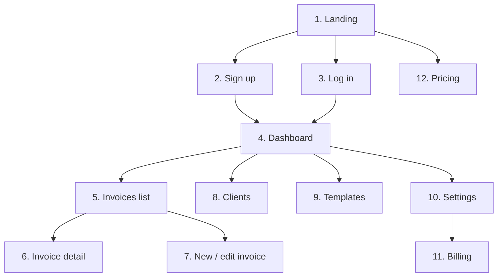

<!--
/**
 * @file docs/design.md
 * @description Design system: colors, typography, spacing, components, and the 12-page breakdown
 * @phase 0
 * @author Payment Chaser Team
 * @created 2026-10-01
 */
-->

# Payment Chaser — Design Guide

| Field | Value |
|-------|-------|
| Status | Draft v1.0 |
| Last updated | 2026-10-01 |
| Stack | Tailwind CSS + Shadcn UI |
| Related | [frontend-brief.md](./frontend-brief.md), [rules.md](./rules.md) |

---

## 1. Design Principles

| # | Principle | What it means in practice |
|---|-----------|---------------------------|
| 1 | **Calm, not nagging** | The product chases money so the user doesn't have to stress; the UI itself stays quiet and confident |
| 2 | **Status at a glance** | Pending, paid, and overdue are recognizable by color, icon, and label within a second |
| 3 | **Fast to act** | Adding an invoice takes under 60 seconds; common actions are one click away |
| 4 | **Trustworthy** | It sends messages in the user's name, so previews and confirmations are clear |
| 5 | **Accessible by default** | WCAG 2.1 AA; never rely on color alone |
| 6 | **Mobile-ready** | Freelancers check payments on phones; usable from 360 px |

---

## 2. Color System

All colors are Tailwind design tokens defined in `tailwind.config.ts`. **Never hardcode hex values in components.**

### 2.1 Brand and semantic colors

| Token | Hex | Usage |
|-------|-----|-------|
| `primary` | `#2563EB` | Primary buttons, links, active nav, focus accents |
| `primary-hover` | `#1D4ED8` | Hover state for primary |
| `primary-soft` | `#DBEAFE` | Primary tinted backgrounds, selected rows |
| `success` | `#10B981` | Paid status, success toasts |
| `success-soft` | `#D1FAE5` | Paid badge background |
| `warning` | `#F59E0B` | Pending status, due-soon hints |
| `warning-soft` | `#FEF3C7` | Pending badge background |
| `danger` | `#EF4444` | Overdue status, destructive actions, errors |
| `danger-soft` | `#FEE2E2` | Overdue badge background |
| `info` | `#0EA5E9` | Informational banners |

### 2.2 Neutrals

| Token | Hex | Usage |
|-------|-----|-------|
| `background` | `#FFFFFF` | Page background (light) |
| `surface` | `#F8FAFC` | Cards, table headers |
| `border` | `#E2E8F0` | Dividers, input borders |
| `muted` | `#64748B` | Secondary text |
| `foreground` | `#0F172A` | Primary text |

### 2.3 Dark mode (post-MVP, tokens reserved)

| Token | Dark hex |
|-------|----------|
| `background` | `#0B1220` |
| `surface` | `#111A2E` |
| `border` | `#1E293B` |
| `muted` | `#94A3B8` |
| `foreground` | `#F1F5F9` |

### 2.4 Status mapping

| Status | Color | Icon (lucide) | Label |
|--------|-------|---------------|-------|
| `pending` | warning | `Clock` | Pending |
| `paid` | success | `CheckCircle2` | Paid |
| `overdue` | danger | `AlertTriangle` | Overdue |

Status is always shown with **icon + label + color**, never color alone.

### 2.5 Tone mapping (reminders)

| Tone | Color | Meaning |
|------|-------|---------|
| Friendly | success | Gentle nudge |
| Firm | warning | Clear expectation |
| Urgent | danger | Final notice |

### 2.6 Contrast requirements

| Pair | Minimum ratio |
|------|---------------|
| Body text on background | 4.5:1 |
| Large text (≥ 18 px bold / 24 px) | 3:1 |
| UI borders and icons | 3:1 |

Soft backgrounds (`*-soft`) must pair with a darker text shade of the same hue (e.g. `danger-soft` background with `#B91C1C` text).

---

## 3. Typography

| Role | Font | Fallback |
|------|------|----------|
| Sans (UI + headings) | Inter | `system-ui, sans-serif` |
| Mono (invoice numbers, amounts) | JetBrains Mono | `ui-monospace, monospace` |
| Bangla support | Noto Sans Bengali | `sans-serif` |

### 3.1 Type scale

| Style | Size / line-height | Weight | Use |
|-------|-------------------|--------|-----|
| `display` | 36 / 44 | 700 | Landing hero |
| `h1` | 30 / 38 | 700 | Page titles |
| `h2` | 24 / 32 | 600 | Section headings |
| `h3` | 20 / 28 | 600 | Card titles |
| `h4` | 16 / 24 | 600 | Sub-headings, table headers |
| `body` | 16 / 24 | 400 | Default text |
| `body-sm` | 14 / 20 | 400 | Table cells, helper text |
| `caption` | 12 / 16 | 500 | Badges, timestamps |

### 3.2 Rules

| Rule | Detail |
|------|--------|
| Amounts | Mono font, tabular numbers (`tabular-nums`), right-aligned in tables |
| Line length | 60–75 characters for prose |
| Casing | Sentence case for buttons and headings |
| Truncation | Single-line truncate with tooltip for long client names |

---

## 4. Spacing, Layout, and Shape

### 4.1 Spacing scale (4 px base)

| Token | px | Typical use |
|-------|----|-------------|
| `1` | 4 | Icon gaps |
| `2` | 8 | Inline gaps |
| `3` | 12 | Compact padding |
| `4` | 16 | Default padding |
| `6` | 24 | Card padding |
| `8` | 32 | Section gaps |
| `12` | 48 | Page section spacing |
| `16` | 64 | Landing sections |

### 4.2 Breakpoints

| Name | Min width | Layout |
|------|-----------|--------|
| base | 0 | Single column, bottom nav, card lists instead of tables |
| `sm` | 640 px | Two-column forms |
| `md` | 768 px | Sidebar collapses to icons |
| `lg` | 1024 px | Full sidebar, tables |
| `xl` | 1280 px | Max content width 1200 px |

### 4.3 Radius and elevation

| Token | Value | Use |
|-------|-------|-----|
| `rounded-md` | 8 px | Inputs, buttons |
| `rounded-lg` | 12 px | Cards |
| `rounded-full` | — | Badges, avatars |
| `shadow-sm` | subtle | Cards |
| `shadow-md` | medium | Dropdowns, popovers |
| `shadow-lg` | large | Dialogs |

### 4.4 App shell

```
┌──────────────────────────────────────────────┐
│ Topbar: search · notifications · user menu   │
├────────────┬─────────────────────────────────┤
│ Sidebar    │  Page header (title + actions)  │
│ Dashboard  │  ───────────────────────────────│
│ Invoices   │  Content area                   │
│ Clients    │                                 │
│ Templates  │                                 │
│ Settings   │                                 │
└────────────┴─────────────────────────────────┘
```

On mobile the sidebar becomes a bottom navigation bar with 4 items (Dashboard, Invoices, Clients, More).

---

## 5. Component Library

Use Shadcn UI primitives first. Add custom components only when no primitive fits.

### 5.1 Shadcn components to install

| Component | Used for |
|-----------|----------|
| `button`, `input`, `textarea`, `label` | Forms |
| `form` (react-hook-form + Zod) | All validated forms |
| `select`, `checkbox`, `switch`, `radio-group` | Options, channel toggles |
| `calendar`, `popover` | Date picking |
| `table`, `badge`, `card` | Lists and summaries |
| `dialog`, `alert-dialog`, `sheet` | Modals and mobile drawers |
| `dropdown-menu`, `tabs`, `tooltip` | Menus, filters |
| `sonner` (toast) | Feedback |
| `skeleton` | Loading states |
| `avatar`, `separator`, `scroll-area` | Layout details |

### 5.2 Custom components

| Component | Purpose |
|-----------|---------|
| `StatusBadge` | Status icon + label + color |
| `ToneBadge` | Reminder tone display |
| `ChannelIcons` | Email / WhatsApp indicators |
| `CurrencyText` | Mono, tabular amount formatting |
| `StatCard` | Dashboard metric with trend |
| `InvoiceTable` | Sortable list with filters (cards on mobile) |
| `InvoiceForm` | Create/edit with file upload |
| `ClientForm` | Create/edit client |
| `TemplateEditor` | Body editor with variable chips and live preview |
| `ReminderTimeline` | Chronological reminder log on an invoice |
| `EmptyState` | Illustration, message, call to action |
| `PageHeader` | Title, description, primary action |
| `ConfirmDialog` | Destructive confirmations |

### 5.3 Button hierarchy

| Variant | Use |
|---------|-----|
| Primary (filled blue) | One per view: the main action |
| Secondary (outline) | Supporting actions |
| Ghost | Toolbar and tertiary actions |
| Destructive (red) | Delete, cancel subscription |

### 5.4 Required UI states

Every data-driven view must implement all four:

| State | Pattern |
|-------|---------|
| Loading | Skeletons matching the final layout (mock delay is 500 ms to test this) |
| Empty | `EmptyState` with a clear call to action |
| Error | Inline alert with retry |
| Success | Toast confirmation for mutations |

### 5.5 Form rules

| Rule | Detail |
|------|--------|
| Labels | Always visible, never placeholder-only |
| Errors | Below the field, red text with icon, `aria-describedby` linked |
| Required | Marked with an asterisk and `aria-required` |
| Submit | Disabled with a spinner while pending |
| Preservation | Never clear the form on validation failure |

---

## 6. Iconography and Imagery

| Item | Standard |
|------|----------|
| Icon set | `lucide-react`, 16 / 20 / 24 px, 1.75 stroke |
| Channel icons | `Mail` for email; WhatsApp glyph in brand green only inside the channel indicator |
| Illustrations | Simple line illustrations in `primary` tints for empty states |
| Avatars | Initials on `primary-soft` when no image |

---

## 7. Motion

| Rule | Detail |
|------|--------|
| Duration | 150 ms for hovers, 200–250 ms for dialogs and sheets |
| Easing | `ease-out` for entrances, `ease-in` for exits |
| Reduced motion | Respect `prefers-reduced-motion` and disable non-essential animation |
| Purpose | Motion only to show state change; no decorative loops |

---

## 8. Accessibility Checklist

| Item | Requirement |
|------|-------------|
| Keyboard | Every action reachable and operable by keyboard |
| Focus | Visible 2 px `primary` focus ring |
| Landmarks | `header`, `nav`, `main`, `aside` used correctly |
| Headings | One `h1` per page, no skipped levels |
| Tables | Proper `th` with scope; mobile uses a card list |
| Status | Not color alone; icon plus text |
| Forms | Labels, errors, and descriptions programmatically associated |
| Touch targets | Minimum 44 × 44 px on mobile |
| Language | `lang="en"`; Bangla spans marked `lang="bn"` |

---

## 9. The 12-Page Breakdown



### 9.1 Page index

| # | Page | Route | Auth |
|---|------|-------|------|
| 1 | Landing | `/` | Public |
| 2 | Sign up | `/signup` | Public |
| 3 | Log in | `/login` | Public |
| 4 | Dashboard | `/dashboard` | Required |
| 5 | Invoices list | `/invoices` | Required |
| 6 | Invoice detail | `/invoices/[id]` | Required |
| 7 | New / edit invoice | `/invoices/new`, `/invoices/[id]/edit` | Required |
| 8 | Clients | `/clients` | Required |
| 9 | Templates | `/templates` | Required |
| 10 | Settings | `/settings` | Required |
| 11 | Billing | `/settings/billing` | Required |
| 12 | Pricing | `/pricing` | Public |

### 9.2 Page 1 — Landing (`/`)

| Section | Content |
|---------|---------|
| Hero | Headline: stop chasing, start getting paid. Primary CTA "Start free", secondary "See how it works" |
| How it works | 3 steps: Upload, Schedule, Get paid |
| Channels | Email + WhatsApp explainer with reach statistic placeholder |
| Social proof | Testimonial placeholders |
| Pricing teaser | Link to `/pricing` |
| Footer | Product, legal, contact |

States: static. Mobile: stacked sections, sticky CTA.

### 9.3 Page 2 — Sign up (`/signup`)

| Element | Detail |
|---------|--------|
| Fields | Name, email, password |
| Validation | Zod; password strength hint |
| Actions | Create account, link to log in |
| States | Submitting, error (email taken), success redirect to dashboard |

### 9.4 Page 3 — Log in (`/login`)

| Element | Detail |
|---------|--------|
| Fields | Email, password |
| Actions | Log in, forgot password, link to sign up |
| States | Submitting, invalid credentials, success redirect |

### 9.5 Page 4 — Dashboard (`/dashboard`)

| Section | Content |
|---------|---------|
| Stat cards | Outstanding, Overdue, Paid this month, Reminders sent this week |
| Needs attention | Top 5 overdue invoices with days overdue and a "Remind now" action |
| Upcoming | Invoices due in the next 7 days |
| Recent activity | Latest reminders and payments |
| Primary action | "New invoice" in the page header |

States: loading skeletons, empty (first-run onboarding checklist), error with retry.

### 9.6 Page 5 — Invoices list (`/invoices`)

| Element | Detail |
|---------|--------|
| Tabs | All, Pending, Overdue, Paid, each with a count |
| Search | Client name or invoice number |
| Table columns | Invoice #, Client, Amount, Due date, Status, Channels, Actions |
| Row actions | View, Mark paid, Edit, Delete |
| Mobile | Card list with status badge and amount |
| Empty | "No invoices yet" with New invoice CTA |

### 9.7 Page 6 — Invoice detail (`/invoices/[id]`)

| Section | Content |
|---------|---------|
| Header | Invoice number, status badge, amount, actions (Mark paid, Edit, Pause reminders) |
| Summary | Client, issue date, due date, currency, template, channels |
| File | Preview or download of the uploaded invoice |
| Reminder timeline | Scheduled and sent reminders with channel, tone, time, delivery status |
| Danger zone | Delete invoice |

### 9.8 Page 7 — New / edit invoice (`/invoices/new`)

| Field | Type | Validation |
|-------|------|-----------|
| Client | Select with "Add new" | Required |
| Invoice number | Text | Required, unique |
| Amount | Number | > 0 |
| Currency | Select | Default USD |
| Issue date | Date | Required |
| Due date | Date | ≥ issue date |
| File | Upload | PDF/PNG/JPG, ≤ 10 MB |
| Template | Select | Required |
| Channels | Checkboxes (Email, WhatsApp) | At least one; WhatsApp requires client number |
| Reminders enabled | Switch | Default on |

A live "Reminder schedule preview" panel shows when each reminder will go out.

### 9.9 Page 8 — Clients (`/clients`)

| Element | Detail |
|---------|--------|
| List | Name, email, WhatsApp, outstanding amount, invoice count |
| Actions | Add client (dialog), edit, delete (blocked if invoices exist) |
| Empty | "Add your first client" |

### 9.10 Page 9 — Templates (`/templates`)

| Element | Detail |
|---------|--------|
| List | Cards for Friendly, Firm, Urgent plus custom templates |
| Editor | Subject, body, variable chips, live preview with sample data |
| Variables | `{{client_name}}`, `{{amount}}`, `{{currency}}`, `{{invoice_number}}`, `{{due_date}}`, `{{days_overdue}}`, `{{sender_name}}` |
| Rules | Default templates cannot be deleted; they can be duplicated |

### 9.11 Page 10 — Settings (`/settings`)

| Section | Content |
|---------|---------|
| Profile | Display name, business name |
| Preferences | Timezone (default Asia/Dhaka), default currency (USD) |
| Channels | Email sender name, WhatsApp connection status |
| Danger zone | Delete account |

### 9.12 Page 11 — Billing (`/settings/billing`)

| Element | Detail |
|---------|--------|
| Current plan | Name, price, renewal date |
| Usage | Active invoices and reminders used vs quota |
| Actions | Upgrade (Paddle checkout), manage, cancel |
| Invoices | Link to Paddle receipts |

### 9.13 Page 12 — Pricing (`/pricing`)

| Element | Detail |
|---------|--------|
| Plans | Free, Pro, Studio comparison table |
| CTA | Start free / Choose plan |
| FAQ | Billing, WhatsApp costs, cancellation |
| Note | Payments processed by Paddle |

---

## 10. Content & Voice

| Guideline | Example |
|-----------|---------|
| Plain and warm | "Your reminder is scheduled for Friday." |
| No jargon | "Overdue" not "Delinquent" |
| Action-first buttons | "Mark as paid", "Add client" |
| Helpful errors | "Add a WhatsApp number to use this channel." |
| Money | `$1,250.00` with currency code on hover or in detail views |
| Dates | "12 Oct 2026" in the user's timezone |

## 11. Design Deliverables

| Deliverable | Owner |
|-------------|-------|
| Tailwind tokens (`tailwind.config.ts`) | Backend / setup |
| Component implementations | Frontend partner |
| Page implementations on mocks | Frontend partner |
| Accessibility pass | Frontend partner |
| Visual QA against this guide | Product |
