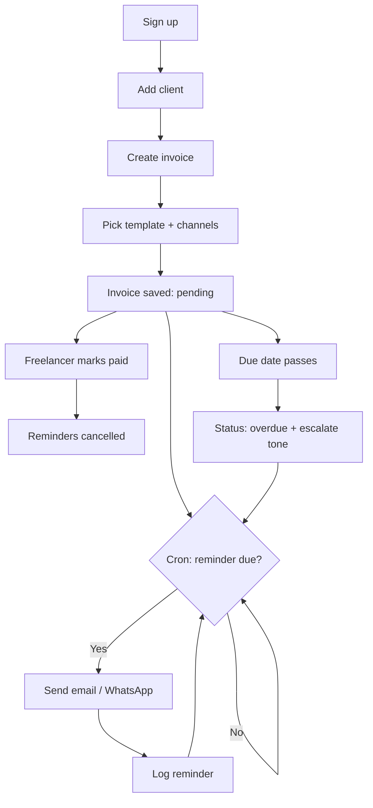

<!--
/**
 * @file docs/prd.md
 * @description Product requirements: problem, goals, user stories, acceptance criteria, non-goals
 * @phase 0
 * @author Payment Chaser Team
 * @created 2026-10-01
 */
-->

# Payment Chaser — Product Requirements Document (PRD)

| Field | Value |
|-------|-------|
| Product | Payment Chaser |
| Version | 1.0 (MVP) |
| Status | Draft |
| Last updated | 2026-10-01 |
| Timezone default | Asia/Dhaka |
| Currency default | USD |

---

## 1. Problem

### 1.1 The core problem

Freelancers do the work, send the invoice, and then wait. When payment is late, they face an uncomfortable choice: send an awkward follow-up or lose time and cash flow.

| Pain point | Impact |
|-----------|--------|
| Following up feels rude or desperate | Freelancers delay or skip reminders entirely |
| Tracking due dates in spreadsheets or memory | Overdue invoices are noticed days or weeks late |
| One channel only (usually email) | Clients ignore email; WhatsApp is where they respond, especially in Bangladesh and South Asia |
| No consistent tone escalation | Reminders are either too soft to work or too harsh to keep the relationship |
| Time spent writing each reminder | Hours per month lost on unbillable admin |

### 1.2 Who feels it most

- Solo freelancers (designers, developers, writers, translators, marketers) with 3–30 active clients.
- Freelancers in Bangladesh who invoice international clients and chase payments across time zones.
- Small agencies of 1–3 people with no finance staff.

### 1.3 Why existing solutions fall short

| Alternative | Gap |
|-------------|-----|
| Full accounting suites | Heavy, expensive, reminders are an afterthought |
| Manual email / WhatsApp | No automation, easy to forget |
| Generic invoicing tools | Email-only reminders, no WhatsApp, no tone escalation |
| Spreadsheets | No sending, no tracking |

### 1.4 Opportunity

A focused tool that does one job — **chase payments politely and automatically across email and WhatsApp** — priced for individual freelancers.

---

## 2. Goals

### 2.1 Product goals

| # | Goal | Measure |
|---|------|---------|
| G1 | Reduce average days-to-payment for active users | −20% within 60 days of onboarding |
| G2 | Make adding an invoice fast | Under 60 seconds from "New invoice" to saved |
| G3 | Make reminders automatic | 100% of invoices with reminders enabled get sent on schedule |
| G4 | Reach clients on the channel they read | WhatsApp + email support from MVP |
| G5 | Keep freelancers in control | Every reminder previewable and pausable |

### 2.2 Business goals

| # | Goal | Measure |
|---|------|---------|
| B1 | Validate demand | 100 signed-up freelancers in first 60 days |
| B2 | Convert to paid | 8% free → paid conversion |
| B3 | Low churn | Monthly churn under 6% |
| B4 | Sustainable unit cost | Messaging cost under 15% of subscription revenue |

### 2.2 Success metrics (north star)

**Invoices paid within 7 days of the first reminder**, as a percentage of all reminded invoices.

---

## 3. Target Users

### 3.1 Personas

**Persona A — "Rafi", Bangladeshi freelance developer**

- Works with 5–8 international clients, invoices in USD.
- Clients often reply on WhatsApp, rarely on email.
- Wants reminders sent in his name without feeling pushy.

**Persona B — "Sara", global freelance designer**

- Works with 10+ small-business clients.
- Loses track of which invoices are overdue.
- Wants a dashboard that shows who owes what at a glance.

**Persona C — "Tanvir", two-person agency owner**

- Handles invoicing alongside client work.
- Needs reusable templates so the tone is consistent.

### 3.2 Market

| Segment | Priority |
|---------|----------|
| Bangladesh freelancers | Primary |
| South Asia freelancers | Secondary |
| Global English-speaking freelancers | Primary |

---

## 4. User Stories

Priority key: **P0** = MVP must-have, **P1** = should-have, **P2** = later.

### 4.1 Authentication & account

| ID | Story | Priority |
|----|-------|----------|
| US-01 | As a freelancer, I can sign up with email so I can start using the product | P0 |
| US-02 | As a freelancer, I can log in and out securely | P0 |
| US-03 | As a freelancer, I can set my display name, business name, and timezone | P1 |
| US-04 | As a freelancer, I can connect my WhatsApp Business sender | P0 |

### 4.2 Clients

| ID | Story | Priority |
|----|-------|----------|
| US-10 | As a freelancer, I can add a client with name, email, and WhatsApp number | P0 |
| US-11 | As a freelancer, I can edit or delete a client | P0 |
| US-12 | As a freelancer, I can see all invoices for a client | P1 |
| US-13 | As a freelancer, I can set a preferred channel per client | P1 |

### 4.3 Invoices

| ID | Story | Priority |
|----|-------|----------|
| US-20 | As a freelancer, I can create an invoice with client, amount, currency, issue date, and due date | P0 |
| US-21 | As a freelancer, I can upload the invoice PDF or image | P0 |
| US-22 | As a freelancer, I can see invoices filtered by status (pending, paid, overdue) | P0 |
| US-23 | As a freelancer, I can mark an invoice as paid | P0 |
| US-24 | As a freelancer, I can edit or delete an invoice | P0 |
| US-25 | As a freelancer, I can search invoices by client or invoice number | P1 |

### 4.4 Reminders & templates

| ID | Story | Priority |
|----|-------|----------|
| US-30 | As a freelancer, I can choose a reminder template (Friendly, Firm, Urgent) for an invoice | P0 |
| US-31 | As a freelancer, I can choose email, WhatsApp, or both | P0 |
| US-32 | As a freelancer, reminders send automatically on schedule without my action | P0 |
| US-33 | As a freelancer, I can preview a reminder before it sends | P1 |
| US-34 | As a freelancer, I can pause reminders for an invoice | P1 |
| US-35 | As a freelancer, I can create and edit custom templates with variables | P1 |
| US-36 | As a freelancer, I can see a log of every reminder sent and its delivery status | P1 |
| US-37 | As a freelancer, I get no more reminders for an invoice once it is paid | P0 |

### 4.5 Dashboard

| ID | Story | Priority |
|----|-------|----------|
| US-40 | As a freelancer, I see total outstanding, total overdue, and total paid this month | P0 |
| US-41 | As a freelancer, I see my most overdue invoices first | P1 |
| US-42 | As a freelancer, I see a trend of payments over time | P2 |

### 4.6 Billing

| ID | Story | Priority |
|----|-------|----------|
| US-50 | As a freelancer, I can subscribe to a paid plan via Paddle | P0 |
| US-51 | As a freelancer, I can view and cancel my subscription | P0 |
| US-52 | As a freelancer, I am limited by plan quotas (invoices, reminders per month) | P1 |

---

## 5. Acceptance Criteria

Written as Given / When / Then. Each maps to the story IDs above.

### AC-20 — Create invoice (US-20, US-21)

- **Given** I am logged in and have at least one client
- **When** I submit the new-invoice form with a valid client, amount > 0, and a due date on or after the issue date
- **Then** the invoice is saved with status `pending` and appears in my invoice list
- **And** invalid input shows field-level errors without losing what I typed
- **And** uploaded files are limited to 10 MB and to PDF, PNG, or JPG

### AC-22 — Status filtering (US-22)

- **Given** I have invoices in all three statuses
- **When** I select a status filter
- **Then** only invoices in that status are shown, with a count per status

### AC-23 — Mark as paid (US-23, US-37)

- **Given** an invoice is `pending` or `overdue`
- **When** I click "Mark as paid"
- **Then** status becomes `paid`, the paid date is recorded, and all future reminders for that invoice are cancelled

### AC-30 — Template and channel selection (US-30, US-31)

- **Given** I am creating or editing an invoice
- **When** I choose a template and one or more channels
- **Then** the selection is stored and used by the scheduler
- **And** choosing WhatsApp when the client has no WhatsApp number is blocked with a clear message

### AC-32 — Automated sending (US-32)

- **Given** an invoice has reminders enabled and a reminder is due
- **When** the scheduled job runs (every hour)
- **Then** the reminder is sent on each selected channel exactly once
- **And** a reminder record stores channel, tone, sent time, and provider message ID
- **And** a failed send is retried up to 3 times and then marked `failed`

### AC-36 — Reminder log (US-36)

- **Given** reminders have been sent
- **When** I open an invoice
- **Then** I see each reminder with channel, tone, time (in my timezone), and status (`sent`, `delivered`, `failed`)

### AC-40 — Dashboard stats (US-40)

- **Given** I have invoices
- **When** I open the dashboard
- **Then** I see totals for outstanding, overdue, and paid this month, calculated in my default currency
- **And** an empty state with a call to action when I have no invoices

### AC-50 — Subscription (US-50, US-51)

- **Given** I am on the free plan
- **When** I complete Paddle checkout
- **Then** my plan upgrades after the Paddle webhook is verified
- **And** cancelling keeps access until the end of the paid period

### AC-SEC — Data isolation (all)

- **Given** two different users
- **When** either queries any table
- **Then** they only ever see their own rows, enforced by Row-Level Security

---

## 6. Functional Requirements

| ID | Requirement |
|----|-------------|
| FR-1 | The system stores invoices, clients, templates, and reminders per user |
| FR-2 | Overdue status is derived: `pending` and due date earlier than today in the user's timezone |
| FR-3 | Templates support variables: `{{client_name}}`, `{{amount}}`, `{{currency}}`, `{{invoice_number}}`, `{{due_date}}`, `{{days_overdue}}`, `{{sender_name}}` |
| FR-4 | The scheduler runs via Vercel Cron on `/api/cron/send-reminders` |
| FR-5 | Reminder sends are idempotent; the same reminder is never sent twice |
| FR-6 | Delivery status updates arrive through provider webhooks |
| FR-7 | All forms are validated with Zod on client and server |
| FR-8 | Billing state is driven only by verified Paddle webhooks |

## 7. Non-Functional Requirements

| Category | Requirement |
|----------|-------------|
| Performance | Dashboard loads under 1.5 s on a 4G connection |
| Availability | 99.5% monthly for the web app and scheduler |
| Security | RLS on every table; secrets only in env vars; webhook signatures verified |
| Privacy | Client contact data is never shared or used outside reminders |
| Accessibility | WCAG 2.1 AA for core flows |
| Responsiveness | Fully usable from 360 px width up |
| Observability | Errors captured with context; no `console.log` in production code |
| Localization | English at launch; Bangla templates on roadmap |
| Compliance | WhatsApp templates follow Meta policy; clients can opt out |

---

## 8. User Flow

---

## 9. Pricing Assumptions (to validate)

| Plan | Price (USD/mo) | Invoices | Reminders / mo | Channels |
|------|---------------|----------|----------------|----------|
| Free | 0 | 3 active | 10 | Email |
| Pro | 9 | 50 active | 300 | Email + WhatsApp |
| Studio | 19 | Unlimited | 1,000 | Email + WhatsApp |

Billing is handled by **Paddle** as Merchant of Record.

---

## 10. Non-Goals (MVP)

The following are explicitly **out of scope** for v1:

| Non-goal | Reason |
|----------|--------|
| Invoice generation / PDF builder | We chase invoices; users bring their own |
| Accepting client payments inside the product | Adds payments compliance; Paddle is for our subscription only |
| Full accounting, tax, or bookkeeping | Different product category |
| SMS or voice call reminders | Cost and scope; revisit after validation |
| Multi-user teams and roles | Single-owner accounts for MVP |
| Native mobile apps | Responsive web first |
| Automated bank reconciliation | Needs bank integrations; manual "mark as paid" for now |
| Debt collection or legal escalation | Legal liability |
| Stripe | Paddle is the only payment provider |

---

## 11. Risks & Mitigations

| Risk | Likelihood | Impact | Mitigation |
|------|-----------|--------|-----------|
| WhatsApp template approval delays | High | High | Submit templates early; email works standalone |
| WhatsApp messaging costs | Medium | Medium | Quotas per plan; track cost per message |
| Reminders sent to wrong person | Low | High | Preview, confirmation, client opt-out |
| Clients mark messages as spam | Medium | Medium | Polite default tone, easy opt-out, sending limits |
| Cron misfires or duplicates | Medium | High | Idempotency keys on reminders; retry with caps |
| Data leakage between users | Low | Critical | RLS everywhere; automated policy tests |
| Paddle webhook spoofing | Low | High | Signature verification, replay protection |

## 12. Dependencies

| Dependency | Needed for | Owner |
|-----------|-----------|-------|
| Supabase project | Auth, DB, storage | Backend |
| Resend domain verified | Email sending | Backend |
| WhatsApp Business account + approved templates | WhatsApp sending | Backend |
| Paddle account and products | Subscriptions | Backend |
| Vercel project with Cron | Hosting, scheduler | DevOps |

## 13. Release Plan

| Milestone | Scope | Target |
|-----------|-------|--------|
| M0 | Docs + scaffold + mocks | Week 1 |
| M1 | Frontend complete on mocks | Week 3 |
| M2 | Supabase auth, schema, RLS | Week 4 |
| M3 | Real invoices, clients, templates | Week 5 |
| M4 | Email + WhatsApp sending, cron | Week 6 |
| M5 | Paddle billing | Week 7 |
| M6 | Private beta | Week 8 |

## 14. Open Questions

| # | Question | Owner |
|---|----------|-------|
| 1 | Should overdue reminders stop after a maximum count? | Product |
| 2 | Do we support multiple currencies on the dashboard or convert to one? | Product |
| 3 | Which Bangla template wording is acceptable and polite? | Product |
| 4 | Should clients get a one-click "I've paid" link? | Product |
