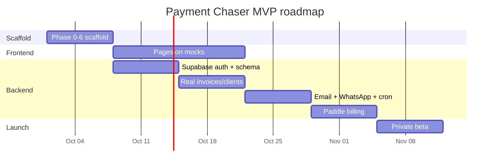

<!--
/**
 * @file docs/task.md
 * @description Phase-by-phase task list and progress tracker for Payment Chaser
 * @phase 0
 * @author Payment Chaser Team
 * @created 2026-10-01
 */
-->

# Payment Chaser — Task List

| Field | Value |
|-------|-------|
| Status | Living document |
| Last updated | 2026-10-01 |
| Related | [prd.md](./prd.md), [architecture.md](./architecture.md), [memory.md](./memory.md) |

> Update checkboxes in the same PR that completes the work. Legend: `[ ]` todo · `[x]` done · `[~]` in progress · `[-]` skipped.

---

## 1. Overview

| Track | Scope | Owner |
|-------|-------|-------|
| Scaffold | Docs, config, types, mocks, action stubs, repo files (37 files) | Backend / lead |
| Frontend | Pages and components built against mocks | Frontend partner |
| Backend | Supabase, Server Actions, cron, providers, billing | Backend / lead |
| Launch | QA, deployment, beta | Everyone |



---

## 2. Scaffold Phases (37 files)

### Phase 0 — Documentation (11 files)

- [x] 1. `docs/README.md`
- [x] 2. `docs/prd.md`
- [x] 3. `docs/architecture.md`
- [x] 4. `docs/rules.md`
- [x] 5. `docs/design.md`
- [~] 6. `docs/task.md`
- [ ] 7. `docs/memory.md`
- [ ] 8. `docs/api.md`
- [ ] 9. `docs/deployment.md`
- [ ] 10. `docs/frontend-brief.md`
- [ ] 11. `docs/mock-strategy.md`

### Phase 1 — Project Setup (5 files)

- [ ] 12. `tailwind.config.ts` — design tokens (primary `#2563EB`, success `#10B981`, etc.)
- [ ] 13. `.env.example` — every env var with a description
- [ ] 14. `vercel.json` — cron for `/api/cron/send-reminders`
- [ ] 15. `next.config.ts` (overwrite)
- [ ] 16. `tsconfig.json` (overwrite)

### Phase 2 — Types & Config (4 files)

- [ ] 17. `src/types/index.ts` — all shared interfaces
- [ ] 18. `src/lib/config.ts` — `USE_MOCK` flag
- [ ] 19. `src/lib/constants.ts` — routes, status labels, tone options
- [ ] 20. `src/lib/utils.ts` (overwrite; Shadcn `cn()`)

### Phase 3 — Mock Data (5 files)

- [ ] 21. `src/lib/mock/index.ts`
- [ ] 22. `src/lib/mock/invoices.ts` — 10–15 invoices (3 pending, 4 paid, 3 overdue)
- [ ] 23. `src/lib/mock/clients.ts` — 5–6 clients
- [ ] 24. `src/lib/mock/templates.ts` — Friendly, Firm, Urgent
- [ ] 25. `src/lib/mock/dashboard.ts`

### Phase 4 — Server Action Stubs (4 files)

- [ ] 26. `src/app/actions/invoices.ts`
- [ ] 27. `src/app/actions/clients.ts`
- [ ] 28. `src/app/actions/templates.ts`
- [ ] 29. `src/app/actions/dashboard.ts`

### Phase 5 — GitHub Templates (4 files)

- [ ] 30. `.github/pull_request_template.md`
- [ ] 31. `.github/ISSUE_TEMPLATE/bug.md`
- [ ] 32. `.github/ISSUE_TEMPLATE/feature.md`
- [ ] 33. `.github/workflows/ci.yml` — lint + build

### Phase 6 — Repo Files (4 files)

- [ ] 34. `.gitignore` (overwrite)
- [ ] 35. `README.md`
- [ ] 36. `CONTRIBUTING.md`
- [ ] 37. `LICENSE`

### Scaffold progress

| Phase | Files | Done |
|-------|-------|------|
| 0 Docs | 11 | 5 |
| 1 Setup | 5 | 0 |
| 2 Types & Config | 4 | 0 |
| 3 Mock Data | 5 | 0 |
| 4 Action Stubs | 4 | 0 |
| 5 GitHub | 4 | 0 |
| 6 Repo | 4 | 0 |
| **Total** | **37** | **5** |

---

## 3. Post-Scaffold Setup Tasks

### 3.1 Local environment

- [ ] Create the Next.js 16 app (App Router, TypeScript, Tailwind)
- [ ] Initialize Shadcn UI and install the components listed in `design.md`
- [ ] Install dependencies: `zod`, `react-hook-form`, `@hookform/resolvers`, `@supabase/supabase-js`, `@supabase/ssr`, `resend`, `lucide-react`, `sonner`
- [ ] Copy `.env.example` to `.env.local` and set `NEXT_PUBLIC_USE_MOCK=true`
- [ ] Confirm `npm run dev`, `npm run lint`, `npm run build` all pass
- [ ] Create the GitHub repository and protect `main`

### 3.2 Accounts and services

- [ ] Supabase project (dev and prod)
- [ ] Resend account and verified sending domain
- [ ] WhatsApp Business account, phone number, and message templates submitted for approval
- [ ] Paddle account (sandbox first) with Free/Pro/Studio products
- [ ] Vercel project linked to the repo

---

## 4. Frontend Track (on mocks)

Details in [frontend-brief.md](./frontend-brief.md).

### 4.1 Foundation

- [ ] App shell: sidebar, topbar, mobile bottom nav
- [ ] Shared components: `StatusBadge`, `ToneBadge`, `ChannelIcons`, `CurrencyText`, `StatCard`, `EmptyState`, `PageHeader`, `ConfirmDialog`
- [ ] Loading skeletons and error boundaries
- [ ] Toast system

### 4.2 Pages

| # | Page | Route | Status |
|---|------|-------|--------|
| 1 | Landing | `/` | [ ] |
| 2 | Sign up | `/signup` | [ ] |
| 3 | Log in | `/login` | [ ] |
| 4 | Dashboard | `/dashboard` | [ ] |
| 5 | Invoices list | `/invoices` | [ ] |
| 6 | Invoice detail | `/invoices/[id]` | [ ] |
| 7 | New / edit invoice | `/invoices/new` | [ ] |
| 8 | Clients | `/clients` | [ ] |
| 9 | Templates | `/templates` | [ ] |
| 10 | Settings | `/settings` | [ ] |
| 11 | Billing | `/settings/billing` | [ ] |
| 12 | Pricing | `/pricing` | [ ] |

### 4.3 Forms (Zod-validated)

- [ ] Invoice form
- [ ] Client form
- [ ] Template editor
- [ ] Settings forms
- [ ] Auth forms

### 4.4 Quality

- [ ] Loading, empty, and error states on every data view
- [ ] Keyboard and screen-reader pass
- [ ] Responsive check at 360 px, 768 px, 1280 px
- [ ] Contrast audit against `design.md`

---

## 5. Backend Track

### 5.1 Database and auth

- [ ] Write initial migration (tables from `architecture.md`)
- [ ] Enable RLS and add policies on every table
- [ ] Write RLS tests (cross-user access, forged `client_id`, service-role-only tables)
- [ ] Supabase Auth: email sign-up, login, logout, session handling
- [ ] Profile row created on sign-up (trigger)
- [ ] Private storage bucket and policy for invoice files
- [ ] Seed script for development data

### 5.2 Server Actions (real implementations)

| Domain | Actions | Status |
|--------|---------|--------|
| Invoices | list, get, create, update, delete, markPaid | [ ] |
| Clients | list, get, create, update, delete | [ ] |
| Templates | list, get, create, update, delete, preview | [ ] |
| Dashboard | getStats, getNeedsAttention, getUpcoming | [ ] |
| Settings | updateProfile, updatePreferences | [ ] |

- [ ] Auth check at the top of every action
- [ ] Zod validation on every input
- [ ] Typed `Result<T>` returns, no leaked errors
- [ ] Flip `USE_MOCK` to `false` per domain and verify parity with mocks

### 5.3 Reminders engine

- [ ] Default escalation schedule generator
- [ ] Reminder rows created on invoice create/update
- [ ] Cancel reminders when marked paid or deleted
- [ ] Template variable renderer with allow-list
- [ ] Cron handler `/api/cron/send-reminders` with `CRON_SECRET`
- [ ] Claim logic with `FOR UPDATE SKIP LOCKED`
- [ ] Retry up to 3 attempts, then `failed`
- [ ] Status job: `pending` → `overdue` in the user's timezone

### 5.4 Providers

- [ ] Email service (Resend) and domain verification
- [ ] WhatsApp service (template messages) and approved templates
- [ ] Webhook: Resend delivery events
- [ ] Webhook: WhatsApp status events
- [ ] Webhook signature verification and idempotency table

### 5.5 Billing (Paddle)

- [ ] Products and prices for Free, Pro, Studio
- [ ] Checkout overlay from the pricing and billing pages
- [ ] Webhook: subscription created, updated, cancelled
- [ ] Plan quota enforcement (active invoices, reminders per month)
- [ ] Billing page: usage, upgrade, cancel

---

## 6. DevOps Track

- [ ] Vercel project, environments, and env vars (see `deployment.md`)
- [ ] `vercel.json` cron schedule verified in preview
- [ ] CI: lint + build on every PR
- [ ] Secret scanning and Dependabot enabled
- [ ] Error monitoring connected
- [ ] Custom domain and SSL
- [ ] Backups and a restore test for Supabase

---

## 7. Testing & QA

| Area | Tasks | Status |
|------|-------|--------|
| Unit | Schedule generator, template renderer, status logic | [ ] |
| RLS | Policy tests for all tables | [ ] |
| Integration | Create invoice → reminders scheduled → cron sends | [ ] |
| Webhooks | Valid, invalid, and replayed signatures | [ ] |
| E2E | Sign up → add client → add invoice → mark paid | [ ] |
| Accessibility | Keyboard, screen reader, contrast | [ ] |
| Cross-device | Chrome, Safari, Android, iOS | [ ] |

---

## 7a. Launch Checklist

- [ ] All MUST rules in `rules.md` verified
- [ ] RLS tests green
- [ ] Paddle in live mode with a test purchase
- [ ] WhatsApp templates approved
- [ ] Privacy policy and terms published
- [ ] Opt-out flow for client reminders works
- [ ] Rollback plan documented
- [ ] Support email set up

---

## 8. Beta & Launch

- [ ] Recruit 10–20 beta freelancers (Bangladesh + global)
- [ ] Feedback form and weekly review
- [ ] Track north star: invoices paid within 7 days of the first reminder
- [ ] Fix top 5 issues from beta
- [ ] Public launch announcement

---

## 9. Backlog (post-MVP)

| Idea | Priority |
|------|----------|
| Bangla reminder templates | P1 |
| Dark mode | P2 |
| Payment trend charts | P2 |
| Client "I've paid" link | P2 |
| CSV import of invoices | P2 |
| Team accounts | P3 |
| SMS channel | P3 |
| Invoice PDF generator | P3 |

---

## 10. Commands Reference (scaffold loop)

| Command | Effect |
|---------|--------|
| `continue` | Generate the next file |
| `skip` | Skip the current file |
| `redo` | Regenerate the last file |
| `status` | Show the scaffold checklist |
| `edit <file>` | Regenerate a specific file |

After each file the assistant prints:

```
✅ DONE: <file-path>
➡️  NEXT: <next-file-path>
👉  Type "continue" to proceed.
```
